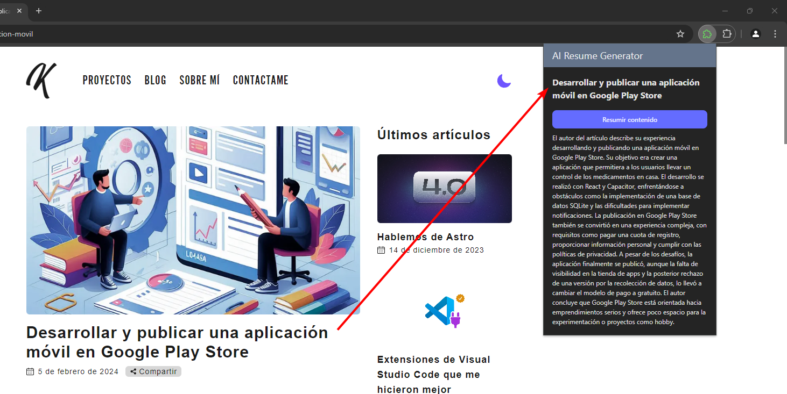

# WXT + Vue 3 + API Google AI Studio

Esta web extension permite resumir noticias mediante la API de [Google AI Studio](https://ai.google.dev/aistudio). La extensión es bastante sencilla, extrae el texto de la etiqueta \<article> y lo envía a la API de Google AI Studio para obtener un resumen del texto. Finalmente se mostrará el resumen en el popup de la extensión.

## Recommended IDE Setup

-   [VS Code](https://code.visualstudio.com/) + [Volar](https://marketplace.visualstudio.com/items?itemName=Vue.volar) (and disable Vetur) + [TypeScript Vue Plugin (Volar)](https://marketplace.visualstudio.com/items?itemName=Vue.vscode-typescript-vue-plugin).
